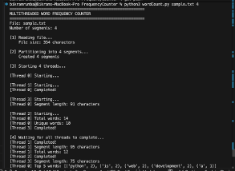
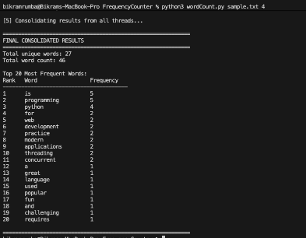

# Multithreaded Word Frequency Counter

## How to Run
```bash
python3 WordCount.py <filename> <num_segments>
```

## Example
```bash
python3 WordCount.py sample.txt 4
```

## Requirements
- Python 3.6+
- No external libraries needed

## Output 


